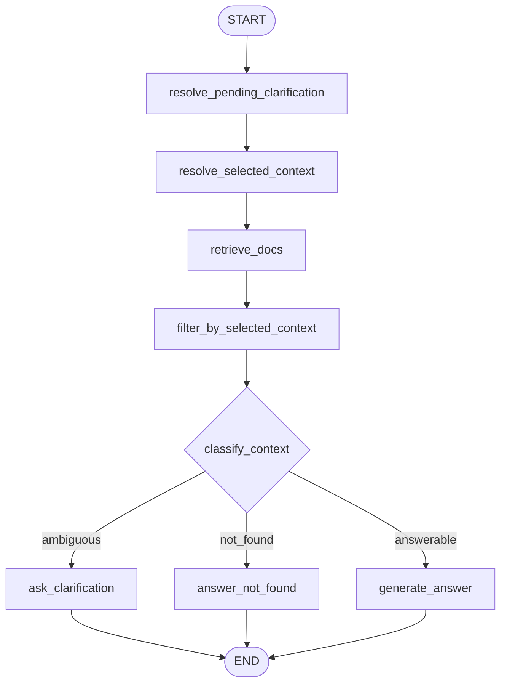

# Contextual RAG Agent

Диалоговый RAG-агент для консультаций по правилам международной стажировки CdekStart (Тестовое задание для CDEK).

Сервис имеет защиту от галлюцинаций, отвечает только по базе знаний из `data/`, поддерживает контекст по `session_id` и задает уточняющие вопросы, если запрос неоднозначный.

## Технический стек

Git
Docker Compose
Python - FastAPI, LangGraph
База знаний - 5 текстовых файлов
LLM - возможность подключить любую LLM (хоть локальную, хоть OPenAI )

## Важно

Система рассчитана только на работу на русском языке

## Поиск по базе знаний

Рассмотрено 2 варианта: 
    1) Векторный поиск через embeddings (семантический поиск)
    2) Лексический поиск c помощью алгоритма BM25

Для данной работы выбран поиск с использованием BM25 и нормализации текста с использованием библиотеки pymorphy3:
    
Плюсы подхода:
1) более легковесная чем embeddings
2) не нужна векторная индексация файлов и дополнительное хранилище для векторов
3) не тратим токены моделей на векторизацию

Ограничения подхода:
1) возможен неточный поиск по базе при сложных формулировках запроса пользователем

Т.к. база данных небольшая, всего 5 файлов, и файлы имеют текст с четкими формулировками, считаю разумным использование данного подхода

При масштабировании базы знаний: увеличения кол-ва файлов и их размеров, а также усложнения формулировок, я бы рассмотрел добавление
embeddings и, соответственно, векторного хранилища  


## Критерии для уточнения запроса (определение неоднозначностей)

В моем решении перед запуском системы есть предварительная классификация документов 2-мя параметрами:

```text
group=country_rules
label=Франция
```

Это нужно для того чтобы программа сама по четкому алгоритму определяла наличие неоднозначности в вопросе, а не отдавала это решение llm 

```text
несколько label внутри одной group -> ambiguous
нет документов -> not_found
однозначный контекст -> answerable
```

Такой подход масштабируется на файловую базу: можно добавлять новые документы, группы и варианты через эти метаданные документов, не переписывая основную логику rag системы.

## Генерация ответа и борьба с галлюцинациями

Используя системные промпты, найденные в базе файлы и контекст диалога, llm либо генерирует ответ, либо задает уточняющий вопрос

Защита от галлюцинаций реализована с помощью системных промтов и маршрутизации исполнения графа в узел not_found при отсутствии релевантных файлов базы знаний  


## Сохранение контекста диалога

Диалог (набор последних сообщений) хранится в словаре по ключу `session_id`.

## Граф



Pipeline:

```text
message
-> resolve pending
-> restore selected
-> BM25 retrieve
-> filter by selected
-> classify context
-> clarify / not_found / answer
```


## Настройка LLM

Тестирование проводилось с помощью llm моделей OpenAi: gpt-5.5, gpt-5.4. И локально развернутой модели llama-3.1 

Подключение модели идет через переменные окружения в файле `.env`, для запуска необходимо создать его

Пример подключение модели OpenAi
```env
LLM_PROVIDER=openai
LLM_MODEL=gpt-5.5
LLM_API_KEY=your_openai_key
LLM_BASE_URL=
```
Пример подключение локальной модели llama-3.1

```env
LLM_PROVIDER=openai
LLM_MODEL=llama-3.1
LLM_API_KEY=ollama
LLM_BASE_URL=http://localhost:11434/v1
```


## Запуск

Docker Compose:

```bash
docker-compose up --build
```

## API

### `POST /chat`

Content-Type: application/json:

```json
{
  "message": "Какая стипендия?",
  "session_id": null
}
```

Ответ:

```json
{
  "answer": "Ответ агента",
  "session_id": "generated-session-id"
}
```

Для продолжения диалога нужно передавать тот же `session_id`.


## Структура Проекта

```text
app/
  main.py                  точка входа FastAPI
  api/routes.py            HTTP endpoints
  core/config.py           настройки
  core/context.py          AppContext
  core/factory.py          сборка приложения
  rag/graph.py             LangGraph
  rag/nodes.py             узлы графа
  rag/state.py             AgentState
  rag/retriever.py         BM25
  rag/knowledge_base.py    загрузка документов
  rag/text_processing.py   preprocessing
  schemas/chat.py          Pydantic модели
  services/llm.py          LLM client
  storage/session_store.py session storage
data/                      база знаний
langgraph.mmd              Mermaid-граф
```

## Дальнейшее развитие проекта

- Заменить in-memory хранилище сессий на Redis или реляционную базу данных.
- Добавить логирование
- При масштабировании базы знаний рассмотреть применение embeddings


